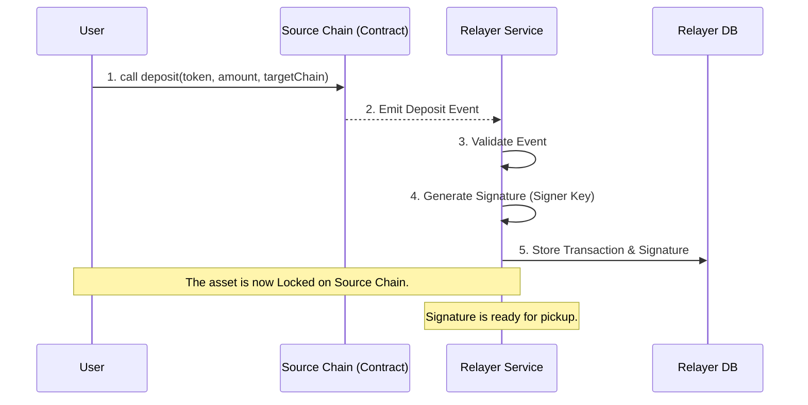
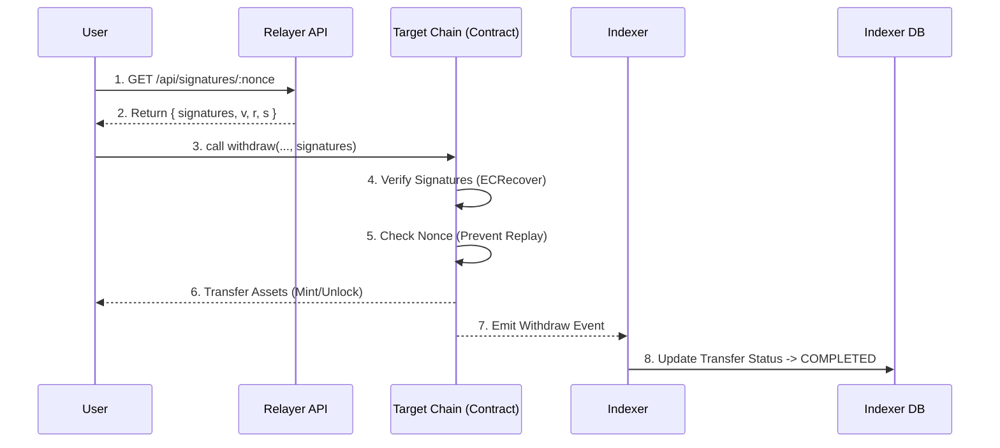

# 🏗️ System Architecture

This document provides a deep dive into the architectural decisions, components, and data flows of the Token Bridge system.

---

## 📐 High-Level Architecture

The Token Bridge implements a **Lock-and-Mint** (or Burn-and-Release) mechanism facilitated by an off-chain validator set. The system is designed to be **event-driven**, maximizing decoupling between services.

### Core Components

1.  **Bridge Contracts (On-Chain)**
    *   **Role**: Trustless custody and settlement.
    *   **State**: Maintains supported tokens, validator set, and used nonces.
    *   **Logic**: 
        *   `deposit()`: Locks assets on Source Chain.
        *   `withdraw()`: Releases assets on Target Chain (requires signatures).
    
2.  **Relayer Service (Off-Chain)**
    *   **Role**: The "Executor" and "Validator".
    *   **Logic**: 
        *   Listens to `Deposit` events via RPC.
        *   Validates event data (chain ID support, token whitelist).
        *   Signs the transfer message with its Validator Key.
        *   Stores the signature in PostgreSQL.
        *   Exposes an API for the frontend to fetch signatures.

3.  **Indexer Service (Off-Chain)**
    *   **Role**: The "Observer".
    *   **Logic**:
        *   Listens to ALL events (Deposits and Withdrawals).
        *   Correlates a Deposit on Chain A with a Withdrawal on Chain B.
        *   Maintains the "Lifecycle" of a transfer (Pending -> Completed).
        *   Provides clean data APIs for the UI.

4.  **Shared Library**
    *   **Role**: The "Contract".
    *   **Content**: Shared TypeScript types (`DepositEvent`, `Transfer`), ABIs, and Validation Utilities. Ensures that the Backend and Indexer always speak the same language.

---

## 🔄 Data Flow Diagrams

### 1. Deposit & Signing Flow

This flow describes how a user initiates a transfer and how the system prepares for the release of funds.

### 2. Withdrawal & Settlement Flow

This flow describes how the user claims their funds on the target chain.

---

## 💾 Database Schema Design

### Backend (Relayer) Schema
Designed for **transaction processing**.

*   `BridgeTransaction`: Stores the raw deposit event data.
*   `ValidatorSignature`: Stores the generated signature for a specific transaction hash.
*   `ChainState`: Tracks the last processed block number to handle server restarts/crashes without missing events.

### Indexer Schema
Designed for **data retrieval and analytics**.

*   `Transfer`: Represents a full cross-chain lifecycle. It links a `depositTxHash` to a `withdrawTxHash`.
*   `BridgeEvent`: Raw log of every event triggered on contracts.
*   `ChainSync`: Tracks sync progress for indexing.

---

## 🔒 Security Architecture

### 1. Replay Protection
We utilize a global `nonce` per sender-recipient pair (or globally per bridge, checking implementation). The contract checks `usedNonces[hash]` before processing a withdrawal.
*   **Mechanism**: `hash = keccak256(token, sender, amount, nonce, chainId)`
*   **Check**: `require(!isProcessed(hash))`

### 2. Access Control
*   **Pausable**: The Owner can pause `deposit` and `withdraw` functions.
*   **Validator Management**: Only the Owner can add/remove validators.
*   **Threshold Signatures**: Withdrawals check `signatures.length >= minValidators`.

### 3. Consistency
*   **Atomic Updates**: Database operations use transactions where possible.
*   **Idempotency**: The implementation handles duplicate events gracefully (e.g., if a block is re-orged or processed twice).

---

## 🚀 Scalability & Performance

*   **Polling vs. WebSockets**: Currently configured for Polling for robustness, but architecture supports switching to WS for lower latency.
*   **Separate Indexer**: By moving historical queries to a separate service, the critical path (Relayer signing) remains fast and lightweight.
*   **Horizontal Scaling**: The Indexer and Backend are stateless (state is in DB/Chain) and can be scaled horizontally behind a load balancer.

---

## 🧪 Testing Strategy

### Smart Contracts (Foundry)
*   **Unit Tests**: Test individual functions (`deposit`, `withdraw`).
*   **Fuzz Tests**: Test with random inputs to find edge cases.
*   **Integration Tests**: Simulate full flows on local Anvil fork.

### Backend/Indexer (Jest/Manual)
*   **Service Tests**: Verify API endpoints.
*   **E2E Tests**: Run local Anvil, deploy contracts, run services, execute scripts, verify DB state (as detailed in `TESTING_GUIDE.md`).
