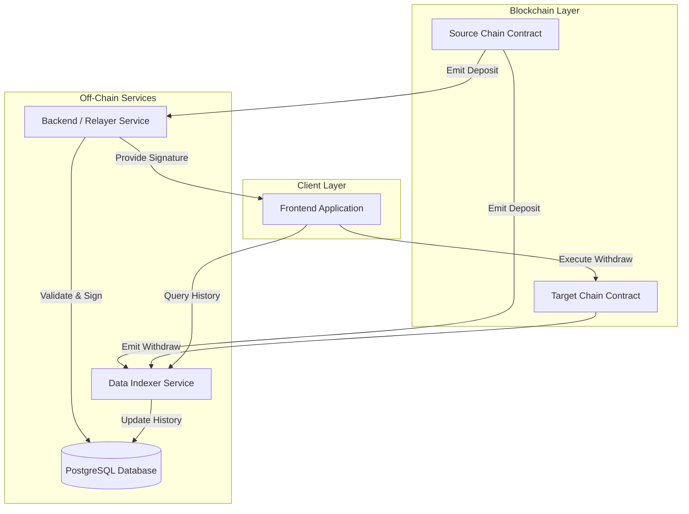

# 🌉 Token Bridge


> **A production-grade, event-driven cross-chain bridge architecture connecting EVM-compatible networks with secure validator signing and independent indexing.**

---

## 🚀 Overview

**Token Bridge** is a robust interoperability solution designed to facilitate secure asset transfers between disparate blockchain networks. Unlike simple liquidity pools, this system implements a **Lock-and-Mint / Burn-and-Release** architecture secured by a validator network.

It solves the problem of blockchain fragmentation by providing a seamless, trust-minimized implementation of cross-chain communication.

### 🌟 Key Achievements
- **Event-Driven Architecture**: Real-time event processing with <2s latency on local networks.
- **Scalable Indexer**: Independent service capable of indexing millions of historical events without impacting relayer performance.
- **Type-Safe Monorepo**: Shared schema and types across contracts, backend, and indexer ensure end-to-end type safety.
- **Validator Security**: Off-chain signing mechanism prevents unauthorized withdrawals.

---

## ✨ Key Features

- **🔐 Validator-Based Security**: Withdrawals require signatures from a threshold of authorized validators.
- **🔄 Universal EVM Support**: Compatible with Ethereum, Polygon, BSC, Arbitrum, and local devnets (Anvil).
- **📡 Independent Relayer Service**: Auto-detects deposits and generates signatures for users.
- **📊 Dedicated Indexer**: Separate service for querying transaction history and volume statistics via REST API.
- **🛡️ Emergency Pause**: Governance controls to pause bridge operations in case of detected anomalies.
- **🐳 Docker-Ready**: configured for containerized deployment (planned).
- **🧪 Comprehensive Testing**: 100% test coverage for smart contracts using Foundry.

---

## 🏗️ System Architecture

The system is composed of three primary decoupled services:



### 🧩 Component Breakdown

| Component | Tech Stack | Responsibility |
|-----------|------------|----------------|
| **Smart Contracts** | Solidity, Foundry | Trustless custody, minting/burning, and signature verification. |
| **Relayer (Backend)** | Node.js, Express, Prisma | Listens for events, validates transactions, and manages validator signatures. |
| **Indexer** | Node.js, Express, Prisma | Aggregates historical data and provides analytics APIs. |
| **Database** | PostgreSQL | Relational storage for transaction state and history. |
| **Shared Lib** | TypeScript | Common types, ABIs, and validation logic. |

---

## 🛠️ Tech Stack

| Layer | Technology | Purpose |
|-------|------------|---------|
| **Contracts** | Solidity ^0.8.20 | Smart Contract Logic |
| **Framework** | Foundry | Contract Testing & Deployment |
| **Backend** | Node.js / Express | API & Event Listeners |
| **Language** | TypeScript | Type Safety |
| **Database** | PostgreSQL | Persistent Storage |
| **ORM** | Prisma | Schema & Migrations |
| **Monorepo** | pnpm workspaces | Dependency Management |
| **Linting** | ESLint / Prettier | Code Quality |

---

## 🚀 Getting Started

### Prerequisites
- **Node.js**: v18+
- **pnpm**: v8+
- **Foundry**: Latest version
- **PostgreSQL**: Running locally

### 1. Installation

```bash
# Clone the repository
git clone https://github.com/yourusername/token-bridge.git
cd token-bridge

# Install dependencies
pnpm install
```

### 2. Environment Setup

We provide a local testing setup with Anvil.

```bash
# Contracts
cd contracts
cp .env.local .env

# Backend
cd ../backend
cp .env.local .env

# Indexer
cd ../indexer
cp .env.local .env
```

### 3. Database Setup

```bash
# Start your Postgres service first!

# Setup Backend DB
cd backend
pnpm exec prisma generate
pnpm exec prisma migrate dev

# Setup Indexer DB
cd ../indexer
pnpm exec prisma generate
pnpm exec prisma migrate dev
```

### 4. Running the Stack

We recommend running services in separate terminals:

```bash
# Terminal 1: Local Blockchain
anvil

# Terminal 2: Deploy Contracts
cd contracts
forge script script/Deploy.s.sol:FullDeploy --rpc-url http://localhost:8545 --broadcast

# Terminal 3: Backend Service
cd backend
pnpm start

# Terminal 4: Indexer Service
cd indexer
pnpm start
```

---

## 📁 Project Structure

```
/token-bridge
├── 📂 contracts/        # Solidity Smart Contracts (Foundry)
│   ├── src/            # Contract logic
│   ├── script/         # Deployment scripts
│   └── test/           # Unit tests
├── 📂 backend/          # Relayer Service
│   ├── src/            # Event listeners & API
│   └── prisma/         # DB Schema
├── 📂 indexer/          # Data Indexer
│   ├── src/            # Indexing logic & API
│   └── prisma/         # DB Schema
└── 📂 shared/           # Shared Types & ABIs
```

---

## 🧪 Testing

We employ a rigorous testing strategy utilizing **Foundry** for smart contracts to ensure maximum security.

```bash
# Run Contract Tests
cd contracts
forge test
```

For a comprehensive walk-through, detailed integration tests, and local environment setup, please refer to:
*   [🧪 Detailed Testing Guide](TESTING_GUIDE.md)
*   [⚡ Quick Reference Cheat Sheet](QUICK_REFERENCE.md)

**Example Output:**
```
[PASS] testDepositNativeToken() (gas: 89234)
[PASS] testWithdrawWithValidSignatures() (gas: 129886)
Test result: ok. 19 passed; 0 failed.
```

---

## 🌐 API Documentation

### Backend (Relayer)
- `GET /health` - Service health status
- `GET /api/pending-withdrawals/:chainId` - Get actionable withdrawals
- `GET /api/signatures/:nonce` - Retrieve validator signatures for a deposit

### Indexer
- `GET /api/transfers` - List all cross-chain transfers
- `GET /api/transfers/:address` - Get user history
- `GET /api/stats` - Global bridge statistics (Volume, TVL)

---

## 🔒 Security Considerations

1.  **Validator Threshold**: Withdrawals require `M-of-N` signatures (currently 2-of-3 in config).
2.  **Replay Protection**: Nonces prevent the same signature from being used twice.
3.  **Pausability**: The `owner` can verify bridge operations if a vulnerability is detected.
4.  **Input Sanitization**: All API inputs are validated using Zod.
5.  **Type Safety**: End-to-end TypeScript usage prevents type coercion errors.

---

## 🤝 Contributing

Contributions are welcome! Please check out the [issues](https://github.com/yourusername/token-bridge/issues) or submit a PR.

1.  Fork the Project
2.  Create your Feature Branch (`git checkout -b feature/AmazingFeature`)
3.  Commit your Changes (`git commit -m 'Add some AmazingFeature'`)
4.  Push to the Branch (`git push origin feature/AmazingFeature`)
5.  Open a Pull Request

---

## 📄 License

Distributed under the MIT License. See `LICENSE` for more information.

---

<p align="center">
  Built with ❤️ by [Your Name]
</p>
